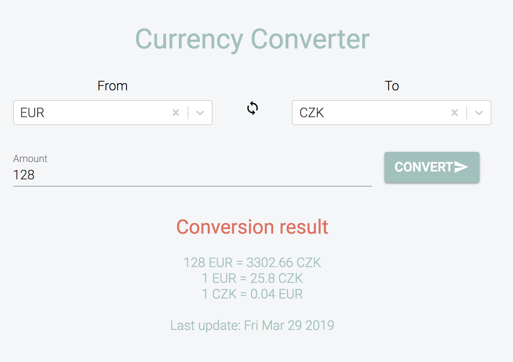

# [Currency converter](https://currency-converter-demo.netlify.com/)



A simple currency converter built by React.js with the help of [exchangeratesapi](https://exchangeratesapi.io)

## Features

- Convert currency
- Swap currency

## Technologies

- [React.js](https://reactjs.org/)
- [Webpack](https://webpack.js.org/)
- [fetch](https://github.com/github/fetch)
- [Material UI](https://material-ui.com/)
- [react-select](https://react-select.com/home)

## Getting started

### Clone repository

```bash
git clone git@github.com:anhpham1509/currency-converter.git
```

### Install dependencies

```bash
yarn install
```

### Start development server

```bash
yarn start
```

### Unit and snapshot testing

```bash
yarn test
```

### Build for production release

```bash
yarn run dist
```
